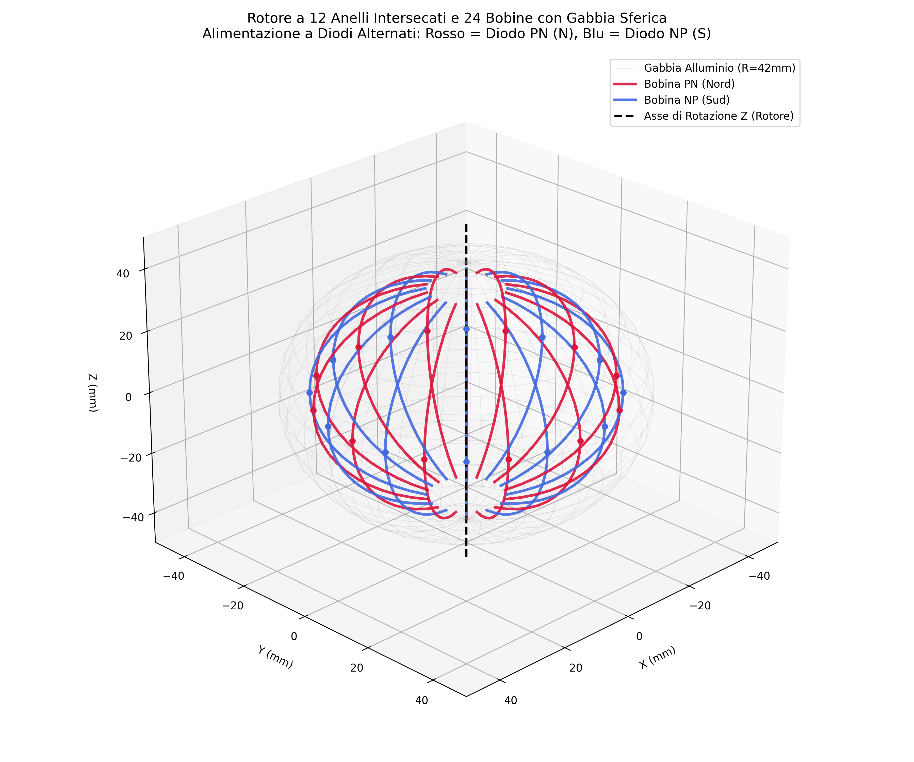
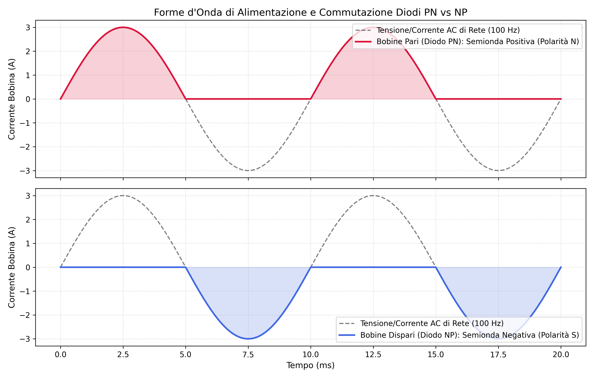
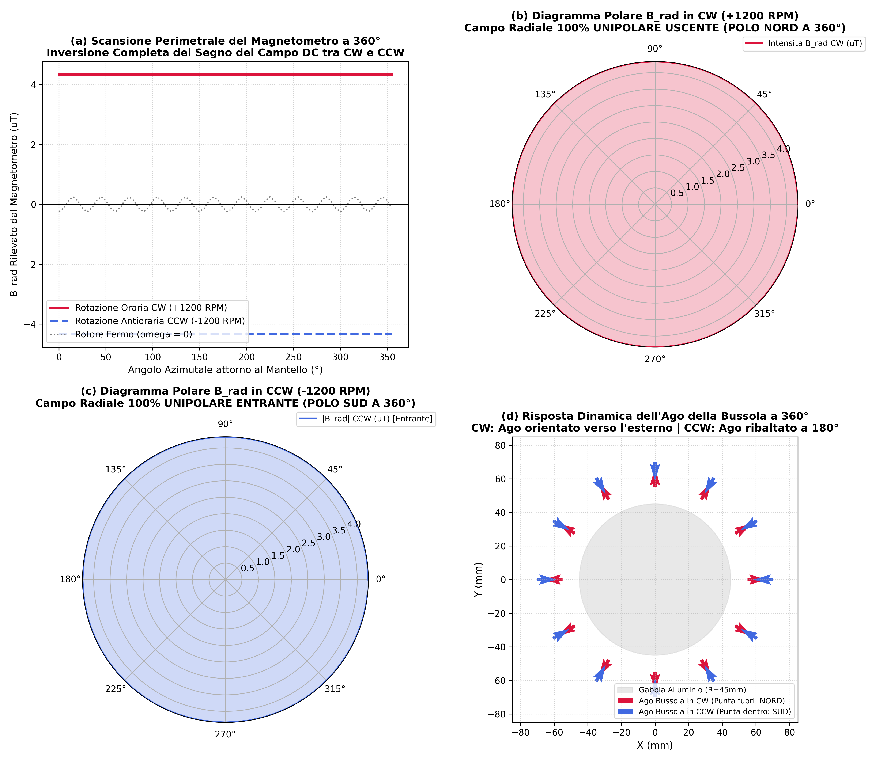

# Dispositivi Elettromeccanici Toroidali e Prototipi Elettromagnetici Chiral

Repository ufficiale di ricerca, documentazione sperimentale e modelli numerici FEM per rotori elettromeccanici toroidali e prototipi a flusso magnetico asimmetrico.  
Licenza Hardware: [CERN-OHL-S-2.0](LICENSE.txt) | Licenza Software: [Apache-2.0](https://www.apache.org/licenses/LICENSE-2.0) | Autore: **Alessandro Brescacin**

---

## 1. Prototipo Reale a Due Bobine (Evidenza Sperimentale Primaria)

Il nucleo sperimentale primario di questa ricerca è costituito dal **prototipo fisico a due bobine** e dalla caratterizzazione magnetometrica al banco prova.

- **Registrazione Video Originale (con audio):** [`variants/prototipo_c_2bobine_misure_2026/evidence/Screen_Recording_20260128_204455_Physics%20Toolbox%20Suite.mp4`](variants/prototipo_c_2bobine_misure_2026/evidence/Screen_Recording_20260128_204455_Physics%20Toolbox%20Suite.mp4) (registrata il 28 gennaio 2026, SHA-256 `390306a9e5b2eef5d39636138e197a54c410f86e5409dc135669d1edfb1c8466`).
- **Analisi Tecnica e Modello di Riferimento:** [`variants/prototipo_c_2bobine_misure_2026/ANALISI_PRELIMINARE.md`](variants/prototipo_c_2bobine_misure_2026/ANALISI_PRELIMINARE.md).

### 1.1 Architettura Costruttiva della Macchina
La macchina reale è composta da:
- **Rotore sagomato a C:** due nuclei ferromagnetici verticali alti circa $100\text{ mm}$ con interasse di circa $100\text{ mm}$, imperniati su un asse di rotazione centrale alla base.
- **Avvolgimenti verticali:** su ciascun braccio è avvolta una bobina multistrato a **9 strati** di filo conduttore smaltato.
- **Gabbia esterna cilindrica fissa:** il rotore gira all'interno di un cilindro fisso in rete di alluminio con maglie incrociate a X.
- **Sonda di misura:** magnetometro a 3 assi triassiale di smartphone (tramite suite *Physics Toolbox*), mantenuto con lo schermo rivolto verso l'alto durante la traslazione dal basso verso l'alto.

| Componente | Caratteristica Prototipo Reale | Note e Parametri Operativi |
| :--- | :--- | :--- |
| **Rotore** | Struttura a C, 2 bracci verticali da ~100 mm distanziati di ~100 mm | Asse di rotazione centrale |
| **Nuclei** | Due nuclei ferromagnetici verticali | Elevata permeabilità magnetica |
| **Bobine** | 2 bobine verticali, 9 strati di avvolgimento per braccio | Alimentazione ad eccitazione impulsiva / AC |
| **Gabbia** | Cilindro fisso in rete di alluminio a maglie inclinate a X | Schermatura ed effetto correnti parassite (Lenz) |
| **Strumento** | Magnetometro triassiale (Physics Toolbox Suite) | Schermo rivolto verso l'alto per l'intera scansione |

### 1.2 Dati di Misura Estratti dalla Registrazione
Dall'analisi fotogramma per fotogramma a frequenza di campionamento di circa $1\text{ Hz}$ sono state estratte le componenti del campo magnetico totale e il modulo:

- **Dati numerici completi:** [`variants/prototipo_c_2bobine_misure_2026/data/video_axes_positions_1hz.csv`](variants/prototipo_c_2bobine_misure_2026/data/video_axes_positions_1hz.csv)
- **Grafico temporale assi X, Y, Z:** [`variants/prototipo_c_2bobine_misure_2026/video_axes_positions_1hz.png`](variants/prototipo_c_2bobine_misure_2026/video_axes_positions_1hz.png)
- **Serie temporale modulo totale:** [`variants/prototipo_c_2bobine_misure_2026/data/video_total_1hz.csv`](variants/prototipo_c_2bobine_misure_2026/data/video_total_1hz.csv)

| Segmento Scansione | Posizione Sonda | $B_X$ Medio ($\mu\text{T}$) | $B_Y$ Medio ($\mu\text{T}$) | $B_Z$ Medio ($\mu\text{T}$) | Modulo Medio ($\mu\text{T}$) | Normale Uscente Macchina |
| :---: | :---: | :---: | :---: | :---: | :---: | :---: |
| **0 – 4 s** | Sotto il dispositivo | $+24.48$ | $-23.60$ | $-36.56$ | **$50.19$** | $-Z$ |
| **6 – 16 s** | Fianco laterale del cilindro | $+5.03$ | $+2.00$ | $-18.16$ | Variabile | Combinazione $X/Y$ |
| **20 – 28 s** | Sopra il dispositivo | $+4.36$ | $+2.26$ | $-13.77$ | **$16.31$** | $+Z$ |

### 1.3 Analisi della Polarità e Fondo Geomagnetico Locale
Nel sistema di riferimento dello smartphone, il versore $+Z$ è uscente dallo schermo. Mantenendo lo schermo rivolto verso l'alto, la normale geometrica uscente dal dispositivo corrisponde a $-Z$ nella parte inferiore e a $+Z$ nella parte superiore.
La misurazione a macchina spenta nell'ambiente di prova di laboratorio indica un fondo naturale di modulo pari a circa $35 - 38\,\mu\text{T}$ (minimo $35\,\mu\text{T}$). Il modello geofisico WMM2025 fornisce a titolo indicativo per la latitudine e data della registrazione un'inclinazione stimata di circa $62.2^\circ$ verso il basso.
Sottraendo la proiezione del fondo geomagnetico, la componente normale attribuibile al dispositivo risulta concorde e uscente sia nella regione inferiore sia in quella superiore, coerentemente con l'osservazione sperimentale al banco.

---

## 2. Prototipi Precedenti e Varianti di Studio (Archivio di Ricerca)

Accanto al prototipo fisico a due bobine, la repository include l'insieme delle architetture e dei modelli teorici, numerici e FEM sviluppati precedentemente nell'ambito del programma di ricerca. Questi prototipi sono documentati e accessibili per consultazione e verifica numerica.

### 2.1 Rotore Toroidale a 12 Anelli in Ferrite e 24 Bobine
- **Directory dedicata:** [`variants/rotore_toroidale_12anelli_ferrite_24bobine/`](variants/rotore_toroidale_12anelli_ferrite_24bobine/)
- **Documentazione archiviata:** [`docs/archive/README_12_anelli_pre_focus_prototipo.md`](docs/archive/README_12_anelli_pre_focus_prototipo.md)
- **Audit e Verifiche:** 
  - [Audit di ablazione del modello](variants/rotore_toroidale_12anelli_ferrite_24bobine/docs/AUDIT_ABLAZIONE_2026-09-29.md)
  - [Simulazione a filamenti su anelli chiusi](variants/rotore_toroidale_12anelli_ferrite_24bobine/docs/SIMULAZIONE_ANELLI_CHIUSI_2026-09-29.md)
  - [Test a circuito aperto e modello multifisico](variants/rotore_toroidale_12anelli_ferrite_24bobine/docs/TEST_CIRCUITO_APERTO_E_CASO_MULTIFISICO_2026-09-29.md)
- **Caratteristiche principali:**
  - 12 anelli in ferrite MnZn ($\mu_r \approx 2000$), disposti attorno all'asse verticale a intervalli di $15^\circ$.
  - 24 bobine toroidali continue avvolte all'interno del foro centrale dei toroidi.
  - Alimentazione AC a semionde alternate mediante diodi PN e NP contrapposti.
  - Gabbia sferica in alluminio con traferro di $2\text{ mm}$.
  - Risultato caratteristico: inversione del dipolo macroscopico esteriore con l'inversione del senso di rotazione meccano-elettrico (CW vs CCW).

| Geometria a 12 Anelli | Schema Diodi PN/NP | Risposta Campo Magnetico CW/CCW |
| :---: | :---: | :---: |
|  |  |  |

### 2.2 Prototipi Toroidali Verticali (2, 8 e 24 Bobine)
- [`variants/rotore_toroidale_verticale_2bobine_vertice/`](variants/rotore_toroidale_verticale_2bobine_vertice/): Configurazione a cuspide superiore con due bobine toroidali ad apice biconico.
- [`variants/rotore_toroidale_verticale_8bobine_curve/`](variants/rotore_toroidale_verticale_8bobine_curve/): Modulazione a 8 bobine toroidali sagomate ad arco curvo con sequenza di fase progressiva.
- [`variants/rotore_toroidale_verticale_24bobine_curve/`](variants/rotore_toroidale_verticale_24bobine_curve/): Matrice a 24 bobine toroidali continue per la sintesi di onde superficiali elicoidali.

### 2.3 Gabbia Sferica e Doppio Rotore Ortogonale a 90°
- [`variants/gabbia_sferica_doppio_rotore_90deg/`](variants/gabbia_sferica_doppio_rotore_90deg/): Rotori ortogonali incrociati a $90^\circ$ per sagomatura tridimensionale del vettore di induzione magnetica.
- [`variants/gabbia_sferica_doppio_gruppo_90deg_48coils/`](variants/gabbia_sferica_doppio_gruppo_90deg_48coils/): Architettura a 48 bobine con gabbia metamateriale e pilotaggio polifase.
- [`variants/gabbia_sferica_inner_coils_copper_collimator/`](variants/gabbia_sferica_inner_coils_copper_collimator/): Guida d'onda a collimatore in rame per l'isolamento del flusso centrale.
- [`variants/gabbia_sferica_tripla_rete_rame_48coils_pisano/`](variants/gabbia_sferica_tripla_rete_rame_48coils_pisano/): Gabbia a tripla rete risonante con modulazione secondo sequenze di Pisano/Fibonacci.

### 2.4 Rotori Centrati e Commutazione Polare a Semionda ($Z=0$)
- [`variants/rotore_centrato_poli_alternati_semionda/`](variants/rotore_centrato_poli_alternati_semionda/): Configurazione cilindrica centrata a poli alternati N-S-N-S-N-S alimentati a semionda.
- [`variants/rotore_centrato_mantello_chiuso/`](variants/rotore_centrato_mantello_chiuso/): Schermatura a mantello chiuso per la riduzione delle perdite parassite e bilanciamento dei flussi.
- [`variants/rotore_centrato_z0/`](variants/rotore_centrato_z0/) e [`variants/rotore_centrato_z0_resonance_sweep/`](variants/rotore_centrato_z0_resonance_sweep/): Analisi transitoria di risonanza FEM per il calcolo delle forze ponderomotrici di Maxwell.

### 2.5 Matrice Riepilogativa dei Modelli e File FEM
Tutti i casi FEM, file SIF di Elmer Solver, mesh e script di calcolo sono indicizzati scientificamente nella [Claims Matrix](documentation/claims_matrix.md).

---

## 3. Struttura del Repository

```text
├── LICENSE.txt                  # Licenza CERN-OHL-S-2.0
├── CITATION.cff                 # Dati di citazione del progetto
├── README.md                    # Questo documento
├── documentation/
│   └── claims_matrix.md         # Matrice scientifica di verifica dei modelli
│
└── variants/
    ├── prototipo_c_2bobine_misure_2026/        # PROTOTIPO REALE PRIMARIO
    │   ├── evidence/                           # Video originale con audio (MP4) e metadati
    │   ├── data/                               # Tabelle numeriche X, Y, Z e modulo a 1 Hz
    │   ├── scripts/                            # Script Python di calcolo e traiettoria
    │   ├── ANALISI_PRELIMINARE.md              # Relazione tecnica dettagliata sulle misure
    │   ├── reference_scan.png                  # Grafico scansione Biot-Savart
    │   └── video_axes_positions_1hz.png        # Grafico misure assi del telefono
    │
    ├── rotore_toroidale_12anelli_ferrite_24bobine/ # VARIANTE 12 ANELLI IN FERRITE
    │   ├── config/ (case_macchina.sif, dimensionamento_macchina.json)
    │   ├── scripts/ (simula_rotore_ferrite.py, simulate_closed_rings.py, ...)
    │   ├── data/ (dati_misura_campo_rotazione.json, ...)
    │   ├── figures/ (geometria, schema diodi, campo CW/CCW)
    │   └── docs/ (audit ablazione, anelli chiusi, circuito aperto)
    │
    ├── rotore_toroidale_verticale_2bobine_vertice/ # Varianti toroidali verticali
    ├── rotore_toroidale_verticale_8bobine_curve/
    ├── rotore_toroidale_verticale_24bobine_curve/
    ├── gabbia_sferica_doppio_rotore_90deg/        # Varianti a doppio rotore ortogonale
    ├── gabbia_sferica_doppio_gruppo_90deg_48coils/
    ├── gabbia_sferica_inner_coils_copper_collimator/
    ├── gabbia_sferica_tripla_rete_rame_48coils_pisano/
    ├── rotore_centrato_poli_alternati_semionda/   # Varianti centrate a semionda
    └── rotore_centrato_z0_resonance_sweep/
```

---

## 4. Come Eseguire le Analisi e le Simulazioni

### Dipendenze
```bash
pip install numpy matplotlib scipy pygeomag
```

### 1. Analisi del Prototipo Reale a 2 Bobine
```bash
# Esecuzione del calcolo della traiettoria e scansione di riferimento
python variants/prototipo_c_2bobine_misure_2026/scripts/scan_reference.py
```

### 2. Simulazione del Rotore Toroidale a 12 Anelli
```bash
# Calcolo della risposta magnetica con inversione CW / CCW
python variants/rotore_toroidale_12anelli_ferrite_24bobine/scripts/simula_rotore_ferrite.py

# Simulazione a filamenti su anelli chiusi completi
python variants/rotore_toroidale_12anelli_ferrite_24bobine/scripts/simulate_closed_rings.py
```

---

## 5. Licenza e Autore

- **Autore del Progetto:** Alessandro Brescacin
- **Licenza Hardware:** [CERN Open Hardware Licence Version 2 - Strongly Reciprocal (CERN-OHL-S-2.0)](LICENSE.txt).
- **Licenza Software e Script:** [Apache License, Version 2.0](https://www.apache.org/licenses/LICENSE-2.0).

Per citare questo lavoro:

```bibtex
@misc{brescacin2026prototipi,
  author = {Brescacin, Alessandro},
  title = {Dispositivi Elettromeccanici Toroidali e Prototipi Elettromagnetici Chiral},
  year = {2026},
  publisher = {GitHub},
  howpublished = {\url{https://github.com/brescale27/test-simulations}},
  note = {CERN Open Hardware Licence Version 2 - Strongly Reciprocal}
}
```
