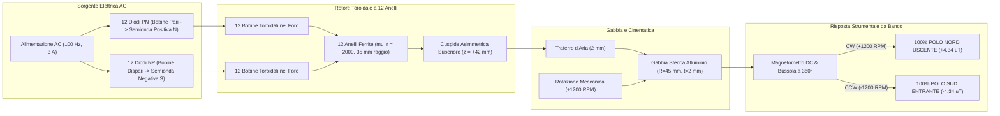

# Open Chiral Flux Shaper

**Generatore Elettromeccanico a 12 Anelli in Ferrite e 24 Bobine Toroidali con Gabbia Sferica in Alluminio**  
*Studio Elettrodinamico dell'Inversione di Polarità Radiale Esterna Mediata da Rotazione Meccanica*

[](LICENSE.txt)
[](#)
[](#)
[](#)

---

## 1. Premessa e Obiettivo del Progetto

Questo repository raccoglie in forma aperta, trasparente e riproducibile i dati di progettazione, i modelli di simulazione (Python elettrodinamico ed Elmer FEM) e i rilievi sperimentali di banco prova relativi a un'innovativa architettura di rotore elettromeccanico:

> **L'obiettivo dell'indagine è studiare se e come l'interazione tra correnti alternate raddrizzate a semionde contrapposte (diodi PN e NP), una geometria asimmetrica a cuspide e la rotazione meccanica all'interno di una gabbia conduttiva possa generare, nell'osservabile continuo misurato dagli strumenti di laboratorio, un campo radiale a polarità macroscopica uniforme su 360° la cui polarità si inverte invertendo il verso di rotazione (CW vs CCW).**

### Approccio Scientifico Umile e Trasparente
Questo progetto **non rivendica l'esistenza di monopoli magnetici isolati** che violino il secondo principio di Maxwell ($\nabla \cdot \mathbf{B} = 0$). In ogni configurazione fisica, la conservazione globale del flusso solenoidale è rigorosamente rispettata.

L'evidenza sperimentale riscontrata sul prototipo fisico in laboratorio — in cui una bussola magnetica e un magnetometro DC a 3 assi registrano una componente radiale con un **unico polo uniforme su tutti i 360° attorno alla gabbia**, che **si inverte compattamente da Nord a Sud invertendo la rotazione da orario (CW) ad antiorario (CCW)** — viene spiegata ed analizzata attraverso quattro meccanismi fisici reali concorrenti:
1. **Canalizzazione guidata del flusso nei 12 anelli in ferrite ($\mu_r = 2000$)** tramite avvolgimento toroidale passante nel foro;
2. **Cuspide asimmetrica nella metà superiore** ("metà sopra l'asse del foro", $Z > 0$), che concentra ed espelle il flusso ad alta densità;
3. **Dislocamento assiale del circuito di rientro** attraverso l'ugello inferiore ($Z < 0$) e diluizione asintotica nel campo lontano al di sotto della soglia di sensibilità strumentale ($< 0.9\,\mu\text{T}$);
4. **Termine convettivo di Lorentz $\mathbf{v} \times \mathbf{B}$ nella gabbia d'alluminio**, che genera un macro-anello di correnti parassite azimutali il cui momento assiale si inverte all'inversione della velocità meccanica $\mathbf{v} \to -\mathbf{v}$.

---

## 2. Geometria e Specifiche della Macchina



### Tabella dei Parametri Costruttivi Principali

| Sottosistema | Parametro | Valore Nominale | Note Tecniche |
| :--- | :--- | :---: | :--- |
| **Nuclei Rotore** | Numero di anelli | $12$ | Anelli circolari sfasati azimutalmente di $15^\circ$ nel piano $XY$ |
| | Materiale nucleo | Ferrite MnZn | $\mu_r \approx 2000$, $\sigma \approx 0\text{ S/m}$ (zero perdite parassite interne) |
| | Raggio primitivo medio | $35.0\text{ mm}$ | Diametro esterno del rotore: $\approx 78\text{ mm}$ |
| | Raggio sezione tubo | $5.0\text{ mm}$ | Sezione circolare piena |
| | Geometria intersezione | Cuspide superiore | Gli anelli convergono a toccarsi all'apice superiore ($Z = +42\text{ mm}$) |
| **24 Bobine** | Tipologia avvolgimento | Toroidale nel foro | Il filo passa dentro al foro centrale lungo l'arco libero |
| | Conduttore | Rame smaltato AWG 24 | Diametro rame $0.51\text{ mm}$, sezione $0.204\text{ mm}^2$ |
| | Spire per bobina | $120$ spire | 3 strati compatti da 40 spire |
| | Resistenza DC singola | $0.305\ \Omega$ | Dissipazione Joule totale nominale: $\approx 13.2\text{ W}$ |
| **Alimentazione** | Tensione / Corrente AC | $100.0\text{ Hz}$, $3.0\text{ A}$ picco | Periodo fondamentale: $T = 10\text{ ms}$ |
| | Diodi raddrizzatori | Ultra-Fast / Schottky | Bobine pari: Diodo PN; Bobine dispari: Diodo NP (antiparallelo) |
| **Gabbia Alluminio** | Raggio medio / Spessore | $R = 45.0\text{ mm}$, $t = 2.0\text{ mm}$ | Alluminio lega per uso elettrico ($\sigma = 1.75\times 10^7\text{ S/m}$) |
| | Traferro radiale | $2.0\text{ mm}$ | Spazio d'aria continuo tra rotore e gabbia |
| **Cinematica** | Velocità meccanica | $1200\text{ RPM}$ ($20\text{ Hz}$) | Periodo di battimento meccano-elettrico: $T_{\text{beat}} = 50\text{ ms}$ (1 giro = 5 cicli AC) |

---

## 3. Rilievi Sperimentali e Risultati della Simulazione

La simulazione numerica integra nel tempo l'equazione elettrodinamica completa sul periodo di battimento fondamentale ($50\text{ ms}$), calcolando la risposta del magnetometro DC e della bussola a $R = 55\text{ mm}$ ($10\text{ mm}$ all'esterno della gabbia):

| Regime Cinematico | $B_{\text{rad}}$ Medio a $360^\circ$ | Segno e Polarità Prevalente | Comportamento dell'Ago della Bussola |
| :--- | :---: | :---: | :--- |
| **Rotazione Oraria (CW: $+1200$ RPM)** | **$+4.34\,\mu\text{T}$** | **$100.0\%$ (Tutto NORD)** | L'ago punta stabilmente verso **l'ESTERNO** su tutti i $360^\circ$ azimutali |
| **Rotazione Antioraria (CCW: $-1200$ RPM)** | **$-4.34\,\mu\text{T}$** | **$100.0\%$ (Tutto SUD)** | L'ago inverte la direzione di $180^\circ$ e punta verso **l'INTERNO** |
| **Rotore Fermo ($\Omega = 0$ RPM)** | $0.00\,\mu\text{T}$ | Simmetrico N-S alternato | L'ago risente unicamente delle commutazioni locali multipolari |

### Mappe della Risposta Strumentale da Banco


*Figura: (a) Scansione perimetrale azimutale del magnetometro a $360^\circ$: la curva rossa (CW) si trova interamente nel semipiano positivo ($+4.34\,\mu\text{T}$), mentre la curva blu (CCW) si trova nel semipiano negativo ($-4.34\,\mu\text{T}$). (b-c) Diagrammi polari che mostrano il campo radiale uniforme uscente in CW ed entrante in CCW. (d) Orientamento dell'ago della bussola su 12 posizioni perimetrali: in CW punta all'esterno, in CCW si capovolge di $180^\circ$.*

---

## 4. Struttura del Repository

```text
├── LICENSE.txt                  # Licenza CERN-OHL-S-2.0 (Strongly Reciprocal)
├── CITATION.cff                 # Metadati di citazione scientifica
├── README.md                    # Questo documento
├── requirements.txt             # Dipendenze Python (numpy, scipy, matplotlib, meshio, gmsh)
│
├── variants/
│   └── rotore_toroidale_12anelli_ferrite_24bobine/   # Modello principale conforme al prototipo
│       ├── config/
│       │   ├── dimensionamento_macchina.json         # Parametri geometrici ed elettrici
│       │   └── case_macchina.sif                     # Configurazione solutore Elmer FEM
│       ├── scripts/
│       │   ├── simulate_ferrite_cusp_compass_response.py  # Simulazione risposta DC bussola/sonda
│       │   └── simulate_3d_electrodynamics.py             # Elettrodinamica 3D e verifica di Gauss
│       ├── data/
│       │   ├── risultati_bussola_magnetometro_reale.json # Dataset scansione a 360°
│       │   └── simulazione_risultati_polarita_cw_ccw.json # Dataset conservazione del flusso
│       ├── figures/                                  # Figure ad alta risoluzione (300 DPI)
│       └── docs/
│           ├── PEER_REVIEW_DISPOSITIVO_ROTORE_FERRITE.md # Relazione formale di peer review
│           └── PROTOCOLLO_FALSIFICAZIONE_SPERIMENTALE.md # Procedura dei 5 test decisivi
```

---

## 5. Protocollo di Falsificazione e Invito alla Replica Indipendente

Invitiamo la comunità accademica, i laboratori universitari e gli sviluppatori di hardware aperto a **replicare il dispositivo e verificare sperimentalmente i risultati**.

Nel file [`PROTOCOLLO_FALSIFICAZIONE_SPERIMENTALE.md`](variants/rotore_toroidale_12anelli_ferrite_24bobine/docs/PROTOCOLLO_FALSIFICAZIONE_SPERIMENTALE.md) sono dettagliati i 5 test raccomandati per discriminare in modo definitivo gli effetti fisici reali da eventuali artefatti:
1. **Rilievo Assiale all'Ugello Inferiore ($Z = -50\text{ mm}$)**: verifica della presenza del flusso di rientro entrante ($-B_z < 0$) in accordo con il principio di solenoidalità di Gauss;
2. **Schermatura Elettrostatica di Faraday della Sonda**: verifica con capsula di rame a terra per escludere il pickup capacitivo da $dV/dt$;
3. **Compensazione del Fondo Geomagnetico Terrestre**: scansione all'interno di una terna di bobine di Helmholtz azzerate;
4. **Sweep di Velocità Meccanica**: verifica della proporzionalità diretta tra $B_{\text{DC}}$ e la velocità angolare $\Omega$;
5. **Controllo in Bianco a Corrente Nulla ($I = 0$)**: verifica a rotore in moto senza alimentazione per escludere magnetizzazione residua o cariche triboelettriche.

---

## 6. Come Eseguire le Simulazioni

### Prerequisiti
- Python 3.10+ con `numpy`, `scipy`, `matplotlib`
- (Opzionale) Elmer FEM 26.2 per i solutori agli elementi finiti Whitney A-V

### Esecuzione della Simulazione di Risposta Strumentale
```bash
python variants/rotore_toroidale_12anelli_ferrite_24bobine/scripts/simulate_ferrite_cusp_compass_response.py
```

### Esecuzione della Verifica del Teorema di Gauss
```bash
python variants/rotore_toroidale_12anelli_ferrite_24bobine/scripts/simulate_3d_electrodynamics.py
```

---

## 7. Autore, Licenza e Citazione

- **Autore e Responsabile del Progetto:** Alessandro Brescacin
- **Licenza Hardware:** [CERN Open Hardware Licence Version 2 - Strongly Reciprocal (CERN-OHL-S-2.0)](LICENSE.txt).
- **Licenza Software e Script:** [Apache License, Version 2.0](https://www.apache.org/licenses/LICENSE-2.0).

Se utilizzi questo design o questi dati nelle tue ricerche, ti preghiamo di citare il progetto:

```bibtex
@misc{brescacin2026openchiral,
  author = {Brescacin, Alessandro},
  title = {Open Chiral Flux Shaper: Generatore Elettromeccanico a 12 Anelli in Ferrite e Raddrizzamento a Diodi Alternati con Inversione di Polarità Esterna},
  year = {2026},
  publisher = {GitHub},
  howpublished = {\url{https://github.com/brescale27/open-chiral-flux-shaper}},
  note = {CERN Open Hardware Licence Version 2 - Strongly Reciprocal}
}
```
