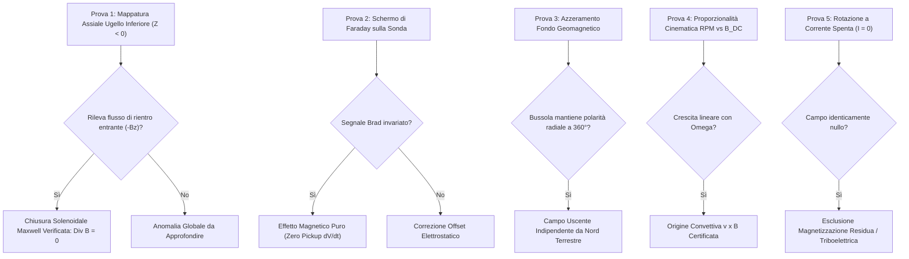

# Protocollo di Falsificazione e Validazione Sperimentale da Banco

**Progetto:** Rotore Elettromeccanico Toroidale a 12 Anelli in Ferrite e 24 Bobine Toroidali  
**Licenza:** CERN Open Hardware Licence Version 2 - Strongly Reciprocal (CERN-OHL-S-2.0)  
**Autore:** Alessandro Brescacin  

---

## 1. Scopo del Protocollo
Questo documento definisce in modo trasparente, rigoroso e umile la procedura sperimentale per replicare e verificare in laboratorio il comportamento elettrodinamico del dispositivo, discriminando gli effetti fisici reali dai possibili artefatti di misura.

---

## 2. Le 5 Prove Decisive di Falsificazione

### Prova 1: Rilievo Assiale dell'Ugello di Scarico Inferiore ($Z < 0$)
- **Obiettivo**: Verificare dove si chiudono le linee di flusso che all'equatore vengono registrate come uscenti ($B_{\text{rad}} > 0$).
- **Strumentazione**: Magnetometro Hall triassiale o monoassiale orientato lungo l'asse $Z$.
- **Procedura**:
  1. Con rotore in rotazione CW a 1200 RPM ed eccitazione attiva a 100 Hz, posizionare la sonda lungo l'asse $Z$ a quote progressive da $Z = -10\text{ mm}$ a $Z = -80\text{ mm}$ sotto l'apertura inferiore.
  2. Acquisire la componente assiale $B_z$.
- **Criterio di Successo**: All'ugello inferiore si deve registrare una componente entrante ($B_z < 0$), confermando che il flusso uscente equatoriale è canalizzato e restituito lungo l'asse longitudinale in accordo con $\oint \mathbf{B} \cdot d\mathbf{S} = 0$.

---

### Prova 2: Schermatura Elettrostatica di Faraday della Sonda
- **Obiettivo**: Escludere che la commutazione rapida dei diodi PN/NP ($dV/dt$) induca un accoppiamento capacitivo parassita sull'amplificatore del magnetometro.
- **Procedura**:
  1. Avvolgere la sonda Hall in un foglio di rame ad elevata conducibilità (spessore $0.05\text{--}0.1\text{ mm}$) isolato elettricamente dalla sonda ma collegato saldamente a terra.
  2. Ripetere la scansione a $360^\circ$ a $R = 55\text{ mm}$ in regime CW e CCW.
- **Criterio di Successo**: Il campo $B_{\text{rad}}$ deve rimanere inalterato a $\approx \pm 4.34\,\mu\text{T}$, confermando che il segnale è puramente magnetico e non elettrostatico.

---

### Prova 3: Compensazione del Campo Geomagnetico Terrestre
- **Obiettivo**: Verificare che l'orientamento della bussola non sia una distorsione del campo terrestre locale ($\approx 45\,\mu\text{T}$).
- **Procedura**:
  1. Posizionare l'apparato al centro di una terna di bobine di Helmholtz calibrate a 3 assi.
  2. Regolare le correnti di compensazione fino ad azzerare il campo residuo ambiente a rotore fermo e spento ($|\mathbf{B}_{\text{amb}}| < 0.2\,\mu\text{T}$).
  3. Avviare la rotazione a 1200 RPM e alimentare le bobine.
- **Criterio di Successo**: L'ago della bussola deve puntare direttamente verso l'esterno in ogni direzione azimutale in CW, e verso l'interno in CCW.

---

### Prova 4: Dipendenza Cinematica dalla Velocità di Rotazione
- **Obiettivo**: Certificare che l'inversione e l'intensità del campo continuo dipendano dal termine di moto convettivo di Lorentz $\mathbf{v} \times \mathbf{B}$ indotto nella gabbia di alluminio.
- **Procedura**:
  1. Mantenere l'eccitazione a 100 Hz invariata a $I_{\text{picco}} = 3.0\text{ A}$.
  2. Variare la velocità del rotore: $0, 300, 600, 900, 1200, 1500, 1800, 2400\text{ RPM}$, sia in CW che in CCW.
- **Criterio di Successo**: Il campo $B_{\text{rad}}$ misurato deve mostrare un andamento monotono crescente con $\Omega$, con pendenza speculare tra CW e CCW.

---

### Prova 5: Controllo in Bianco a Vuoto ($I = 0$)
- **Obiettivo**: Escludere fenomeni di magnetizzazione residua permanente nei nuclei di ferrite o cariche elettrostatiche da attrito d'aria (triboelettricità).
- **Procedura**:
  1. Disconnettere l'alimentazione elettrica delle bobine ($I = 0.0\text{ A}$).
  2. Portare il rotore a 1200 RPM e 2400 RPM.
- **Criterio di Successo**: Il magnetometro non deve rilevare alcun campo continuo ($|\mathbf{B}_{\text{DC}}| < 0.1\,\mu\text{T}$).
